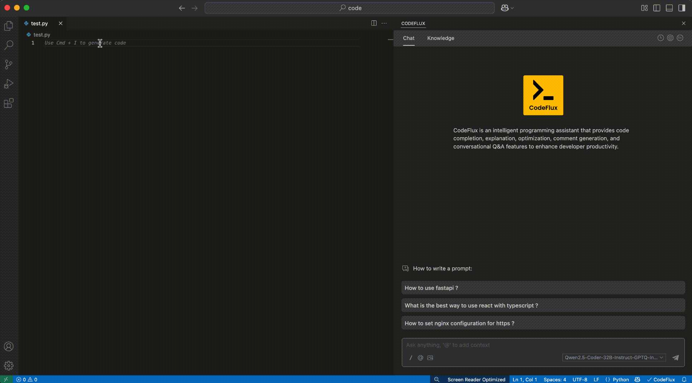
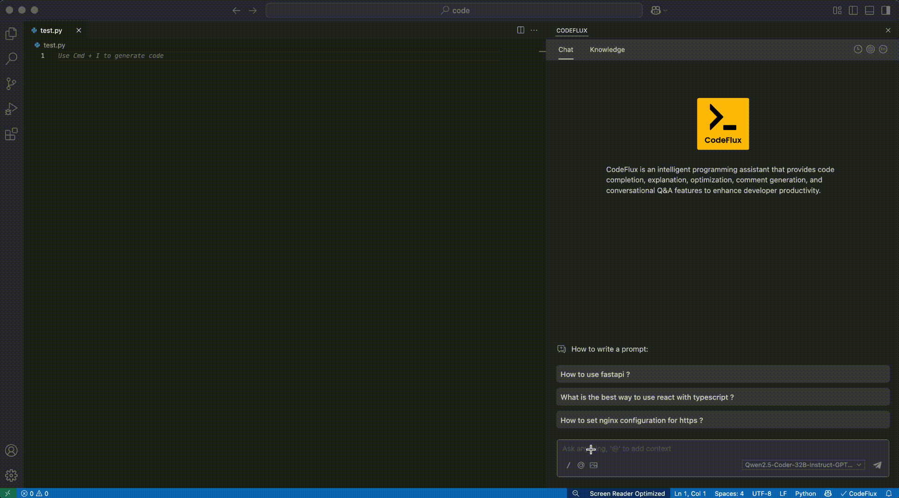

  

  
  

    <strong>CodeFlux</strong> is a leading open-source AI coding assistant. You can connect any model and context to build custom code completion and chat experiences in VS Code
  

  

    
    
    
    
  

  

    <a href="#features">Features</a> •
    <a href="#installation">Installation</a> •
    <a href="#features-in-detail">Features in Detail</a> •
    <a href="#support">Support</a>
  

---

## 🚀 Features

- **Intelligent Code Completion**: Get smart suggestions as you type
- **Context-Aware Chat**: Have meaningful conversations with AI
- **Code Refactoring**: Easily refactor and improve your code
- **Multi-Model Support**: Connect with various AI models
- **Customizable Experience**: Tailor the assistant to your needs
- **Cross-Platform**: Available for VS Code and JetBrains

## 📦 Installation

  <table>
    <tr>
      <td width="50%">
        <h3>VS Code</h3>
        <ol>
          <li>Open VS Code</li>
          <li>Go to the Extensions view (Ctrl+Shift+X)</li>
          <li>Search for "CodeFlux"</li>
          <li>Click Install</li>
        </ol>
      </td>
      <td width="50%">
        <h3>JetBrains IDEs</h3>
        <ol>
          <li>Open your JetBrains IDE</li>
          <li>Go to Settings > Plugins</li>
          <li>Search for "CodeFlux"</li>
          <li>Click Install</li>
        </ol>
      </td>
    </tr>
  </table>

## 🎨 Features in Detail

### Chat

  
  
Have meaningful conversations with AI about your code without leaving your IDE

### Autocomplete

  
  
Get smart code suggestions as you type

### Apply

  
  
Modify code without leaving your current file

### Actions

  
  
Quick shortcuts for common use cases

## 🤝 Contributing

  

We welcome contributions! Here's how you can help:

1. Fork the repository
2. Create your feature branch (`git checkout -b feature/AmazingFeature`)
3. Commit your changes (`git commit -m 'Add some AmazingFeature'`)
4. Push to the branch (`git push origin feature/AmazingFeature`)
5. Open a Pull Request

## 📝 License

  

This project is licensed under the Apache License 2.0 - see the [LICENSE](./LICENSE) file for details.

## 💬 Technical Discussion Group

  
  
Scan the QR code to join our technical discussion group

## 📞 Support

  <table>
    <tr>
      <td align="center">
        <a href="https://github.com/Puhua-AI-Research/CodeFlux-Extention/issues">
           
          <strong>GitHub Issues</strong>
        </a>
      </td>
      <td align="center">
        <a href="https://github.com/Puhua-AI-Research/CodeFlux-Extention/wiki">
           
          <strong>Documentation</strong>
        </a>
      </td>
      <td align="center">
        <a href="https://github.com/Puhua-AI-Research/CodeFlux-Extention/discussions">
           
          <strong>Discussions</strong>
        </a>
      </td>
    </tr>
  </table>

---

  
Made with ❤️ by <a href="https://github.com/Puhua-AI-Research">Puhua AI Research</a>

  
© 2025 CodeFlux. All rights reserved.

